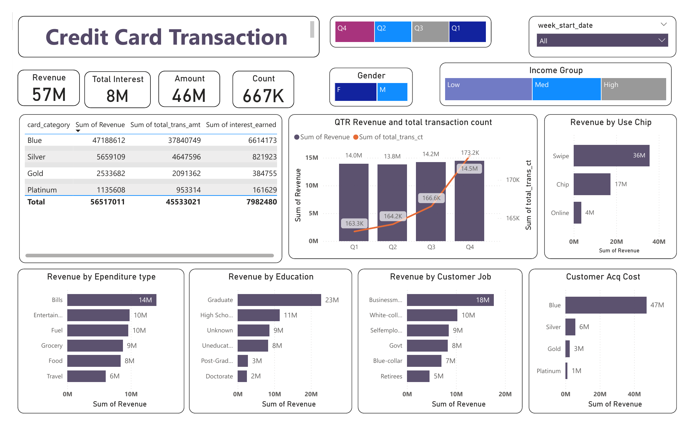
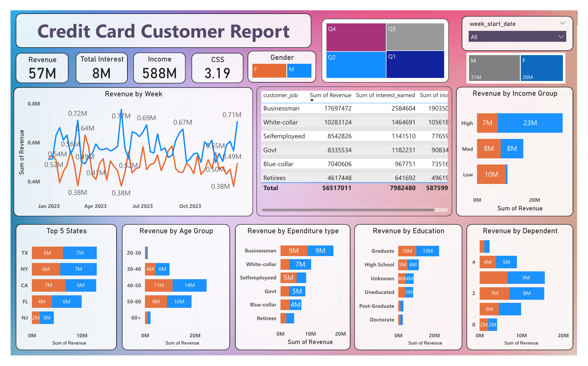

# 💳 Credit Card Weekly Dashboard – Power BI Dashboard

A **Power BI analytics dashboard** built to track and analyze credit card transaction and customer data on a weekly cadence, delivering actionable insights across **revenue, transaction behavior, card performance, and customer demographics**.
This project focuses on translating raw transaction and customer-level data into a **real-time, stakeholder-ready weekly reporting tool**.

---

## 📌 Project Overview

Credit card operations generate continuous transaction and customer data across card types, spending categories, and demographics. Turning that raw data into **decisions** — on revenue tracking, card portfolio performance, and customer targeting — requires a structured, refreshable analytics layer.
This project delivers a **2-page Power BI dashboard** covering transaction-level performance and customer-level demographics, refreshed and reviewed on a weekly basis.

---

## 🎯 Project Objective

To develop a comprehensive credit card weekly dashboard that provides real-time insights into key performance metrics and trends, enabling stakeholders to monitor and analyze credit card operations effectively.

---

## 📂 Dataset Overview

The dataset is **transaction and customer-level credit card data**, including:

- Card Category (Blue, Silver, Gold, Platinum)
- Transaction Amount, Transaction Count, Interest Earned
- Use Chip Method (Swipe, Chip, Online)
- Expenditure Type (Bills, Entertainment, Fuel, Grocery, Food, Travel)
- Customer demographics — Gender, Age Group, Education, Job, Income Group, Dependents, State
- Week Start Date and Quarter (for weekly/quarterly trend tracking)

---

## 🧱 Dashboard Architecture

The report is structured into **two analytical pages**, each serving a specific reporting need:

1. Credit Card Transaction
2. Credit Card Customer Report

Quarter and week-start-date filters, along with gender and income group slicers, are available across both pages for consistent drill-down.

---

## 📊 Page-wise Business Explanation

---

### 1️⃣ Credit Card Transaction

**Business Requirement** Give stakeholders a real-time view of transaction volume, revenue, and interest earned, broken down by card category, spend type, and channel.

**KPIs Displayed**

- Revenue — **57M**
- Total Interest — **8M**
- Amount — **46M**
- Count — **667K**

**Key Features**

- Card category summary table — Blue, Silver, Gold, and Platinum — comparing Sum of Revenue, Sum of Total Transaction Amount, and Sum of Interest Earned (Blue leads with **$47.2M** revenue and **$37.8M** transaction amount)
- **QTR Revenue and Total Transaction Count** combo chart trending revenue (bars) and transaction count (line) across Q1–Q4, showing revenue climbing from 14.0M in Q1 to a Q4 peak alongside transaction count rising to 173.2K
- **Revenue by Use Chip** bar chart comparing Swipe, Chip, and Online — Swipe dominates at **36M** in revenue
- **Revenue by Expenditure Type** bar chart across Bills, Entertainment, Fuel, Grocery, Food, and Travel — Bills leads at **14M**
- **Revenue by Education** and **Revenue by Customer Job** bar charts segmenting revenue by customer background — Graduate-educated customers (**23M**) and Businessmen (**18M**) contribute the most
- **Customer Acquisition Cost** chart by card category, highlighting Blue card's disproportionately high acquisition cost (**47M**) relative to its customer base
- Quarter, week-start-date, gender, and income group slicers filtering the entire page

**Business Value**

- Gives a quick, real-time read on transaction volume and revenue performance by card tier
- Flags which spend categories and channels (chip type) are driving revenue, useful for partner negotiations and rewards design
- Surfaces acquisition cost imbalances across card categories for portfolio strategy decisions

---

---

### 2️⃣ Credit Card Customer Report

**Business Requirement** Give stakeholders a customer-centric view of revenue and interest, segmented by demographics, geography, and household profile.

**KPIs Displayed**

- Revenue — **57M**
- Total Interest — **8M**
- Income — **588M**
- CSS (Customer Satisfaction Score) — **3.19**

**Key Features**

- **Revenue by Week** trend line (Jan 2023 – Oct 2023) comparing male and female customer revenue week over week, with weekly peaks and troughs labeled
- Customer job summary table — Businessman, White-collar, Selfemployed, Govt, Blue-collar, Retirees — comparing Sum of Revenue, Sum of Interest Earned, and Sum of Income (Businessmen lead at **$17.7M** revenue)
- **Revenue by Income Group** chart (Low/Med/High) split by gender
- **Top 5 States** chart (TX, NY, CA, FL, NJ) by revenue, split by gender — TX, NY, and CA are the leading contributors
- **Revenue by Age Group** chart showing the 40–50 age bracket as the strongest revenue segment
- **Revenue by Expenditure Type**, **Revenue by Education**, and **Revenue by Dependent** charts rounding out the customer profile view
- Same quarter, week-start-date, and gender slicers as the Transaction page, for consistent cross-page filtering

**Business Value**

- Identifies the highest-value customer segments (job type, age group, education, geography) for targeted marketing
- Tracks weekly revenue by gender to spot shifting demographic trends early
- Supports customer acquisition and retention strategy with a full demographic revenue breakdown

---

---

## 🛠 Tools & Technologies Used

- **Microsoft Power BI Desktop**
- DAX — KPI calculations, quarter/week-based time intelligence
- Data Modeling — linking transaction, customer, and address tables (`credit_card.csv`, `customer.csv`, `cc_add.csv`, `cust_add.csv`)
- Slicers & Cross-Filtering — quarter, week start date, gender, and income group filters applied across both pages
- KPI Card Design & Dashboard UX

---

## 📈 Weekly Insights Snapshot — Week 53 (31st Dec)

**WoW Change**

- Revenue increased by **28.8%**

**Overview YTD**

- Overall revenue is **57M**
- Total Interest is **8M**
- Total Transaction Amount is **46M**
- Male customers are contributing more in revenue — **31M**, vs. Female **26M**
- Blue & Silver credit cards are contributing to **93%** of overall transactions
- TX, NY & CA are contributing to **68%** of revenue
- Overall Activation Rate is **57.5%**
- Overall Delinquent Rate is **6.06%**

---

## 📚 Key Learnings

- Building a two-page Power BI dashboard covering both transaction-level and customer-level analysis
- Modeling relationships across transaction, customer, and address tables
- Designing consistent cross-page filtering with quarter, week, gender, and income group slicers
- Translating weekly operational data into a recurring stakeholder reporting format
- Segmenting revenue across multiple demographic and behavioral dimensions (job, education, age, dependents, geography)

---

## 🚀 Future Enhancements

- Automated weekly data refresh and email distribution
- Delinquency and activation rate forecasting
- Customer lifetime value (CLV) modeling by card category
- Card-tier upgrade/downgrade prediction based on spend behavior

---

📌 GitHub Repository:
<https://github.com/whoisaustin7/Credit_Card_Dashboard>

---

## 📎 Note

This project analyzes weekly credit card transaction and customer data using Power BI Desktop and DAX, covering the Credit Card Transaction and Credit Card Customer Report pages.
